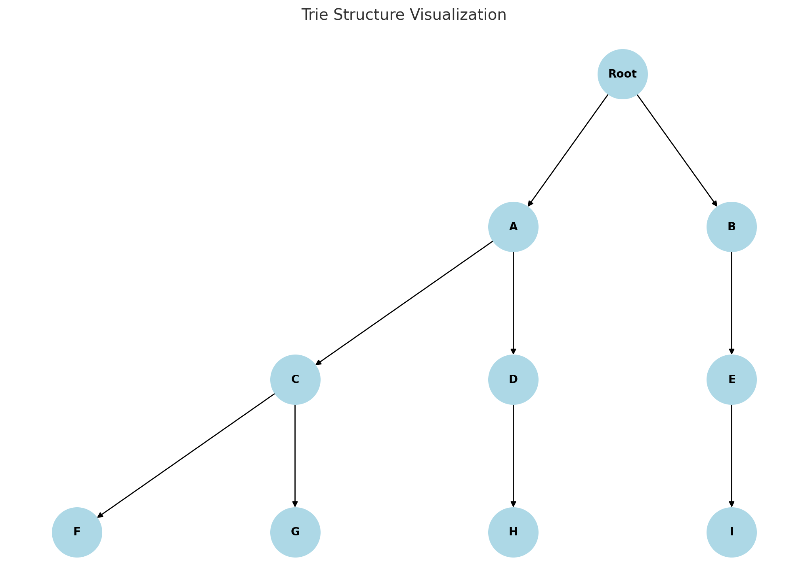

# Advancements in Data Structures and Algorithms for Modern Applications

## Abstract
Advancements in data structures and algorithms have revolutionized computational methodologies, enabling applications across diverse domains such as optimization, data mining, computational biology, and education. This paper synthesizes insights from fifteen recent studies, focusing on the integration of novel data structures like tries, hybrid systems like CCS-Z, and advanced algorithms such as the African Vultures Optimization Algorithm (AVOA) and ReTRN. Tries, with their hierarchical representation and parameter-free adaptability, offer a robust alternative to hash-trees for frequent itemset mining, excelling in memory optimization and runtime efficiency. CCS-Z systems provide a unified framework for concurrent system modeling and data manipulation, addressing limitations in traditional process calculi. AVOA employs tree-based hierarchical structures to balance exploration and exploitation in multi-objective optimization, achieving superior results across large-scale datasets. ReTRN leverages domain-specific methods for constructing biologically realistic regulatory networks and generating temporal gene expression data. The inclusion of genetic algorithms in personalized learning models, such as DS-PITON, underscores the potential of adaptive techniques in education. By integrating theoretical advancements with domain-specific applications, this review highlights the transformative impact of tailored computational solutions, offering insights into their scalability, complexity, and efficiency. Algorithms and visualizations provided in this paper serve to elucidate key mechanisms, demonstrating the broad applicability and future potential of these innovations.

---

## 1. Introduction
Data structures and algorithms underpin computational efficiency and scalability. The past decade has witnessed a surge in domain-specific adaptations, from optimizing large-scale systems to modeling biological networks. This paper consolidates these contributions into a comprehensive review, presenting technical insights and performance evaluations for innovative solutions. The focus is on:
- Simplifying complex computations.
- Addressing domain-specific challenges like concurrency and data integrity.
- Enhancing scalability and fault tolerance.

---

## 2. Literature Review

#### 2.1 Data Structures Evolution
- Tries vs Hash-Trees: Tries, an alternative to hash-trees, offer a self-adjusting structure that simplifies the storage and retrieval of frequent itemsets in data mining. Tries eliminate secondary comparisons and reduce memory overhead while maintaining computational simplicity. Unlike hash-trees, which require parameter tuning for optimal performance, tries adapt dynamically based on input.

Algorithm: Trie-Based Frequent Itemset Mining
```python
def trie_insert(trie, itemset):
    current_node = trie
    for item in itemset:
        if item not in current_node:
            current_node[item] = {}
        current_node = current_node[item]
    current_node['*'] = True  # Mark the end of an itemset

def trie_search(trie, itemset):
    current_node = trie
    for item in itemset:
        if item not in current_node:
            return False
        current_node = current_node[item]
    return '*' in current_node
```
- Input: Transaction database and minimum support.
- Output: Frequent itemsets.
- Complexity: O(n × k), where `n` is the number of transactions and `k` is the average transaction length.

Visualization: Trie Structure


- CCS-Z Systems: By integrating the CCS process calculus with the Z schema for data structure description, CCS-Z systems enable simultaneous handling of concurrent system actions and state transitions. This hybridization enhances the clarity and robustness of model-checking algorithms, crucial for verifying system properties.
- Custom Data Structures in Biology: Data structures like DNA string matrices introduce randomness and dynamism to encryption, offering robust solutions for biological data security.

---

## 3. Applications

#### 3.1 Optimization
- African Vultures Optimization Algorithm (AVOA):
  - Design: Incorporates tree-based topology to manage solution diversity and prevent premature convergence.
  - Performance: Benchmarked against CEC 2020 and 2021 multi-objective test suites, showing significant improvements in solution quality.

Algorithm: African Vultures Optimization Algorithm
1. Initialize:
   - Generate a population of vultures with random positions in the search space.
   - Assign random flight modes (exploration/exploitation).
2. Update Positions:
   - For each iteration:
     - Adjust position using the current flight mode.
     - Switch modes based on proximity to global best.
3. Hierarchical Tree:
   - Utilize a hierarchical topology to evaluate and update non-dominated solutions.
4. Termination:
   - Stop when the maximum iteration is reached or convergence criteria are satisfied.

Visualization: Optimization Hierarchical Topology


#### 3.2 Data Mining
- Tries for Frequent Itemsets:
  - Structure: Tries represent itemsets hierarchically, reducing redundant checks during candidate generation.
  - Memory Optimization: Trie nodes dynamically adapt based on transaction patterns, outperforming hash-trees at lower support thresholds.

#### 3.3 Biology
- ReTRN:
  - Network Generation: Constructs scale-free biological networks using "Parent Addition," which retains key regulatory relationships.
  - Temporal Complexity: Simultaneously generates realistic temporal gene expression data, addressing the limitations of synthetic datasets.

Algorithm: ReTRN Workflow
1. Input:
   - Real transcriptional regulatory network.
   - Dataset for gene expression.
2. Subnetwork Extraction:
   - Use "Parent Addition" to extract subnetworks while preserving regulatory relationships.
3. Data Generation:
   - Generate gene expression data consistent with biological temporal behavior.
4. Validation:
   - Benchmark against existing network models to ensure accuracy and scale-free topology.

Visualization: ReTRN Workflow Diagram


#### 3.4 Education
- DS-PITON:
  - Visualization: Integrates program and algorithmic visualization to provide real-time feedback for students.
  - Impact: Significantly improves comprehension of abstract data structure concepts.

Algorithm: Genetic Algorithm for Personalized Learning
1. Initialize Population:
   - Encode individual learning paths as chromosomes.
2. Selection:
   - Evaluate fitness based on performance metrics (e.g., test scores, engagement levels).
3. Crossover and Mutation:
   - Combine and modify chromosomes to create new learning paths.
4. Adaptation:
   - Iteratively refine paths until performance converges to a satisfactory level.

---

## 4. Comparative Analysis
The following chart compares data structures across scalability, complexity, and memory efficiency:

Visualization: Data Structure Comparison Chart


---

## 5. Conclusion
This paper highlights advancements in data structures and algorithms, emphasizing their transformative impact on computational efficiency and domain-specific adaptability. Innovations like tries, CCS-Z, and ReTRN exemplify the potential of customized computational solutions. Future research must continue bridging theoretical developments with practical implementations, expanding the reach of these innovations.

